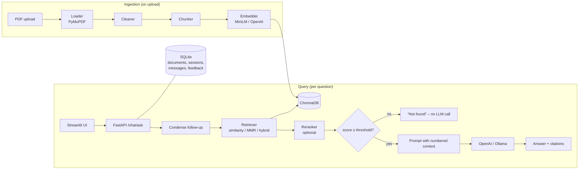

# Academic Question Answering System (RAG)

Ask questions about your own study PDFs (lecture notes, textbooks, previous-year papers) and get **grounded answers that cite the file and page** they came from. If the answer is not in your material, the system says *"I couldn't find this in your uploaded material."* instead of guessing.

Project P_102 · Python · LangChain · ChromaDB · FastAPI · Streamlit · runs on an 8 GB laptop.

## Features

- **Upload PDFs** with a subject tag. Text is extracted page by page, cleaned (running headers/footers, page numbers and hyphenation removed), chunked and embedded.
- **Cited answers** such as `[1]`, `[2]`, with expandable source cards (file · page · snippet).
- **Refuses out-of-scope questions** without calling the LLM, using a relevance score threshold.
- **Follow-up questions**: "explain its advantages" is rewritten using the chat history.
- **Filters** by subject or document, and top-k control.
- **Three retrieval modes**: similarity, MMR (default) and hybrid (BM25 + vector). An optional cross-encoder reranker is also available.
- **Switchable LLM**: OpenAI (cloud) or LLaMA via Ollama (local, offline), selected by config.
- **Chat sessions and history** stored in SQLite, with 👍/👎 feedback, streaming answers and an evaluation harness (Hit@k, MRR, LLM-judged faithfulness/relevance).

## Architecture



Layers: **UI** (HTTP only) → **API routes** (validation) → **services** (DB + orchestration) → **RAG core** (`ingestion/`, `embeddings/`, `vectorstore/`, `retrieval/`, `llm/`, `chains/`, which never import FastAPI). See [docs/architecture.md](docs/architecture.md) and [docs/adr/ADR-001.md](docs/adr/ADR-001.md).

## Quick start (about 5 minutes)

Requires Python 3.11+ (developed on 3.13).

```bash
git clone https://github.com/not-Lucifer/RAG-based-Question-Answering-System.git
cd RAG-based-Question-Answering-System
python -m venv .venv
# Windows: .venv\Scripts\activate      macOS/Linux: source .venv/bin/activate
pip install -r requirements.txt
cp .env.example .env        # Windows: copy .env.example .env
```

Edit `.env` and choose **one** LLM:

- **OpenAI**: set `OPENAI_API_KEY=` to your key (keep `LLM_PROVIDER=openai`).
- **Local/offline**: install [Ollama](https://ollama.com), run `ollama pull llama3.2:3b`, and set `LLM_PROVIDER=ollama`.

Then, in two terminals:

```bash
make api        # backend  -> http://127.0.0.1:8000/docs
make ui         # frontend -> http://localhost:8501
```

On Windows without `make`, use `.\make.ps1 api` and `.\make.ps1 ui` (and so on for every target below).

Optional: index the bundled sample notes (DBMS, OS, CN) from the command line with `make ingest`. You can also upload them in the UI from `data/samples/`.

The first run downloads the MiniLM embedding model (~90 MB).

## Make targets

| Target | What it does |
|---|---|
| `install` | `pip install -r requirements.txt` |
| `samples` | Regenerate the sample PDFs in `data/samples/` |
| `ingest` | Bulk-ingest `data/samples/` (`scripts/ingest_folder.py`) |
| `api` / `ui` | Run FastAPI (port 8000) / Streamlit (port 8501) |
| `test` | Run the offline test suite |
| `eval` | Run the retrieval evaluation |
| `reset` | Wipe the index (`scripts/reset_index.py`) |
| `lint` / `format` | ruff + black |

## Configuration

Secrets and machine settings go in **`.env`** (gitignored; start from `.env.example`). Tunables go in **`config/settings.yaml`**. Environment variables override the YAML, and nested keys use `__` (e.g. `RETRIEVAL__TOP_K=7`).

| Setting | Default | Notes |
|---|---|---|
| `LLM_PROVIDER` | `openai` | `openai` or `ollama` |
| `OPENAI_API_KEY` | — | Only in `.env`. Stored as a secret: masked in logs and `repr` |
| `OPENAI_MODEL` / `OLLAMA_MODEL` | `gpt-4o-mini` / `llama3.2:3b` | |
| `EMBEDDING_PROVIDER` | `local` | `local` (MiniLM, CPU) or `openai` (`text-embedding-3-small`) |
| `CHROMA_DIR`, `RAW_DIR`, `DATABASE_URL` | `./data/...` | Relative paths resolve against the project root |
| `MAX_UPLOAD_MB` | `50` | |
| `retrieval.mode` | `mmr` | `similarity`, `mmr` or `hybrid` |
| `retrieval.top_k` / `fetch_k` | `5` / `20` | |
| `retrieval.score_threshold` | `0.25` | Cosine similarity below this means "not found" |
| `retrieval.use_reranker` | `false` | Avoid enabling together with a local LLM on 8 GB |
| `chunking.chunk_size` / `chunk_overlap` | `1000` / `150` | Run `reset_index.py --reindex` after changing |
| `memory.history_turns` | `4` | |

**Changing the embedding model** makes the existing vectors incompatible. The API then refuses queries with `INDEX_MISMATCH`. Rebuild the index with `python scripts/reset_index.py --reindex`.

## API

Interactive docs are at `/docs`.

| Method | Endpoint | Purpose |
|---|---|---|
| GET | `/health` | Status, LLM provider/model, indexed document count |
| POST | `/documents/upload` | multipart `file` (PDF) + optional `subject` |
| GET | `/documents` | Library |
| DELETE | `/documents/{id}` | Removes file, vectors and row |
| POST | `/documents/{id}/reindex` | Re-run ingestion |
| POST | `/chat/ask` | `{question, session_id?, subject?, doc_ids?, top_k?, mode?}` returns `{answer, sources[], session_id, latency_ms, message_id}` |
| POST | `/chat/stream` | Same, as Server-Sent Events (`token` … `sources`) |
| GET / DELETE | `/sessions`, `/sessions/{id}/messages`, `/sessions/{id}` | Chat history |
| POST | `/feedback` | `{message_id, rating: 1 or -1, comment?}` |

Errors are always `{"error": CODE, "detail": message}`. The codes are `INVALID_FILE` (400), `FILE_TOO_LARGE` (413), `EMPTY_PDF` (422), `DUPLICATE_DOCUMENT` (409), `NOT_FOUND` (404), `LLM_UNAVAILABLE` (503), `INDEX_MISMATCH` (409) and `VALIDATION_ERROR` (422).

## Command-line tools

```bash
python scripts/ingest_folder.py --path data/samples --subject DBMS   # --dry-run to only chunk
python scripts/ask_cli.py "What is 3NF?"                              # or no argument for a chat loop
python scripts/reset_index.py --reindex                               # rebuild vectors from stored PDFs
python scripts/run_eval.py --modes similarity mmr hybrid              # add --llm for answer quality
```

## Testing and evaluation

`make test` runs the whole suite **offline** in about 20 seconds. It uses deterministic fake embeddings, a fake chat model and temp directories, so there are no downloads, API calls or writes to `data/`. It covers the loader, cleaner, chunker, vector store, retrieval modes and filters, the RAG chain and memory, the full API flow and upload security, and the Streamlit UI.

`make eval` builds throwaway indexes at chunk sizes 500 and 1000, then scores each retrieval mode:

| Metric | Measures | MVP target |
|---|---|---|
| Hit@k | Expected page appears in the top-k results | ≥ 0.80 at k=5 |
| MRR | Rank of the first correct chunk | ≥ 0.60 |
| Refusal accuracy | Out-of-scope questions answered "not found" | ≥ 90% |
| Faithfulness / Relevance (`--llm`) | LLM judge, 1–5 | ≥ 4.0 |

`evaluation/qa_dataset.json` currently contains only 3 schema examples. **Write your own 20–30 questions** from your notes; results are saved to `evaluation/results/`.

## Security

- No secrets in the repository. `.env` is gitignored and `.env.example` holds placeholders only. The OpenAI key is a `SecretStr`, and API keys and bearer tokens are redacted from all log output.
- Uploads are checked for size limit, `.pdf` extension, MIME type and `%PDF-` magic bytes. Files are stored as `<uuid>.pdf` (so a client filename can never choose the path), and display filenames are sanitised.
- Unexpected server errors return a generic message. Details go only to the server log.

## Deployment (Render)

`render.yaml` defines two services:

- **`rag-api`**: FastAPI, with a persistent disk at `/var/data` and slim `requirements-prod.txt` (no PyTorch). It uses OpenAI embeddings and LLM.
- **`rag-ui`**: Streamlit. It reaches the API over Render's private network.

`OPENAI_API_KEY` is marked `sync: false`, so Render asks for it in the Dashboard; it is never committed. Validate with `render blueprints validate`, then create the Blueprint from the Render Dashboard. Persistent disks require a paid instance type.

## Project structure

```
app/            core/ api/ schemas/ ingestion/ embeddings/ vectorstore/ retrieval/ llm/ chains/ db/ services/
frontend/       streamlit_app.py, api_client.py, components/
scripts/        ingest_folder, ask_cli, reset_index, run_eval, make_samples
evaluation/     qa_dataset.json, metrics.py
tests/          offline pytest suite
config/         settings.yaml
docs/           architecture.md, adr/, screenshots/, report/
```

## Limitations and future work

Scanned PDFs have no extractable text and are rejected with `EMPTY_PDF`; OCR is future work. The app is English-only, single-user and has no authentication. Future enhancements include quiz and flashcard generation, previous-year-paper analysis, multilingual (Hindi + English) retrieval and diagram understanding.
