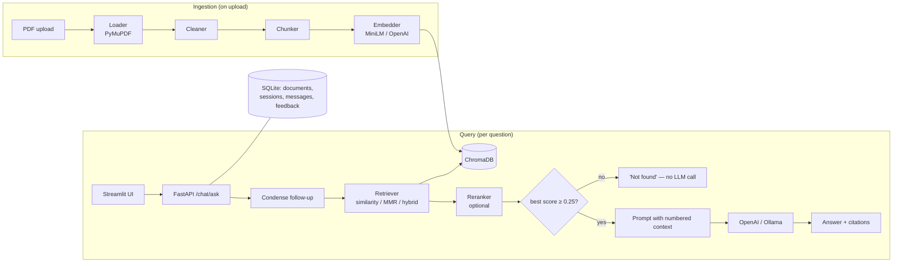
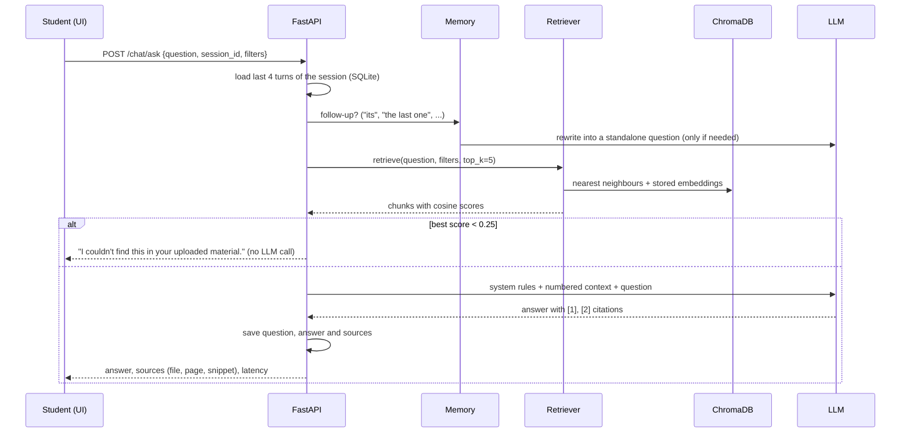
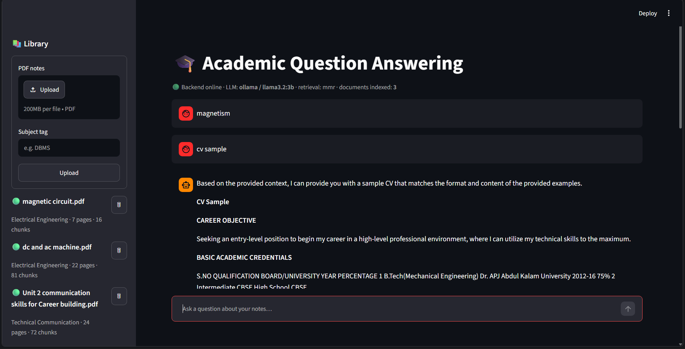
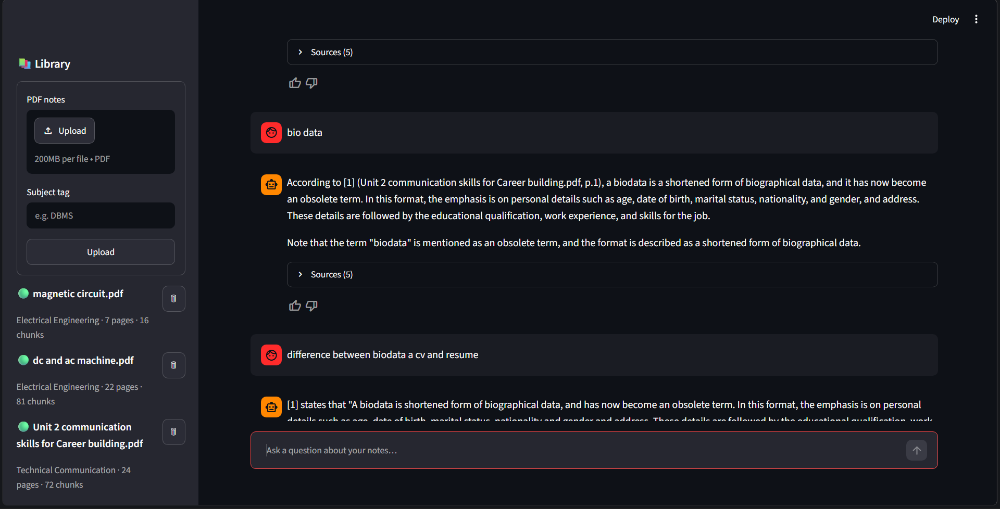
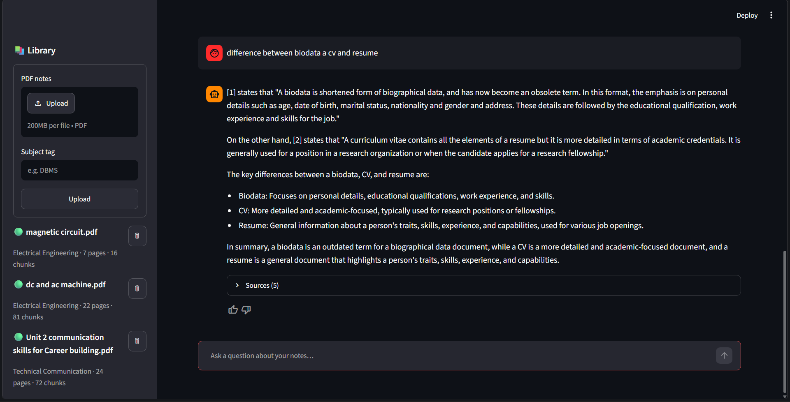

# Academic Question Answering System Using Retrieval-Augmented Generation

**Project Report · Project ID P_102**

| | |
|---|---|
| Submitted by | Aman Singh · [Roll number] |
| Programme | [B.Tech, branch, semester] |
| Institution | [College / University] |
| Guide | [Guide name, designation] |
| Date | [Submission date] |
| Repository | https://github.com/not-Lucifer/RAG-based-Question-Answering-System |

---

## Abstract

Students keep their study material as many PDFs: lecture notes, textbooks, previous-year papers. Finding one precise answer means searching through all of them by hand. General-purpose chatbots answer instantly, but their answers are not grounded in the student's syllabus, cannot say where they came from, and can be confidently wrong.

This project builds a Retrieval-Augmented Generation (RAG) system that answers questions **only from the student's own PDFs** and **cites the file and page** of every claim. It works as follows:

- Uploaded PDFs are extracted page by page, cleaned, split into overlapping chunks, embedded with a local sentence-transformer model (all-MiniLM-L6-v2) and stored in a ChromaDB vector database.
- For each question, the most relevant chunks are retrieved and passed to a large language model, which answers from them with inline citations.
- The model can be OpenAI's gpt-4o-mini or a local LLaMA 3.2 3B served by Ollama.
- When nothing relevant is found, the system replies *"I couldn't find this in your uploaded material."* instead of guessing.

The system supports follow-up questions, filtering by subject and document, three retrieval strategies (similarity, MMR and hybrid BM25 + vector), streaming answers and chat history. It consists of a FastAPI backend with SQLite and a Streamlit frontend, and it runs on an ordinary laptop.

It was evaluated on 30 questions over three real course PDFs (53 pages): Electrical Engineering and Technical Communication. The results were:

- **Retrieval:** Hit@5 = 1.00 and MRR = 0.95–0.96 in every configuration.
- **Refusals:** 100% of out-of-scope questions were refused, including near-domain traps.
- **Answers:** relevance 4.23/5 at about 5.4 s per answer on a laptop GPU.
- **Faithfulness:** 3.46–3.69/5 as judged by the same 3B model, below the 4.0 target. This measurement proved noisy.

---

## 1. Introduction

### 1.1 Problem statement

Study material is scattered across many PDFs. A student revising for an exam wants to ask "what is the difference between a resume and a CV?" and get the answer *from their own notes*, with the page to read, not a generic internet answer. General chatbots have three problems for this use:

1. They are not grounded in the syllabus; their answer may differ from what the teacher taught.
2. They cannot cite where an answer came from, so it cannot be checked.
3. They hallucinate: when they do not know, they still answer.

### 1.2 Objectives

1. Ingest multiple academic PDFs and index them with page-level metadata.
2. Answer natural-language questions with grounded answers citing file and page.
3. Refuse questions whose answer is not in the uploaded material.
4. Support follow-up questions within a conversation.
5. Allow filtering by subject and document.
6. Run on an 8 GB laptop, with a switch between a cloud LLM (OpenAI) and a local LLM (Ollama).
7. Measure quality with an evaluation set: retrieval hit rate, faithfulness and relevance.

### 1.3 Scope

| In scope | Out of scope (future work) |
|---|---|
| Text-based (digital) PDFs | Scanned PDFs needing OCR |
| Single-user local application with chat history | Multi-user accounts, authentication |
| Q&A, definitions, comparisons, summaries of a topic | Quiz / flashcard generation |
| English content | Multilingual (e.g. Hindi) retrieval |
| Web UI (Streamlit) + REST API (FastAPI) | Mobile application |

---

## 2. Background

### 2.1 Retrieval-Augmented Generation

RAG [1] combines a *retriever*, which finds passages relevant to a question, with a *generator*, a language model that writes the answer conditioned on those passages. Grounding the model in retrieved text reduces hallucination and makes answers traceable to sources. It also lets the knowledge base change (new PDFs) without retraining any model.

### 2.2 Dense embeddings and vector search

Text chunks and questions are mapped to vectors by a sentence-embedding model. Sentence-BERT [2] fine-tunes transformer encoders so that semantically similar sentences have nearby vectors; all-MiniLM-L6-v2 is a small distilled model of this family (MiniLM [3]) that produces 384-dimensional vectors and runs on a CPU. Relevance is measured by cosine similarity, and a vector database (ChromaDB) stores vectors with metadata for fast nearest-neighbour search and filtering.

### 2.3 Maximal Marginal Relevance (MMR)

Plain top-k similarity often returns several near-duplicate chunks. MMR [4] selects results that are relevant to the query *and* different from the ones already chosen:

> MMR = argmax over unselected d of [ λ · sim(d, q) − (1 − λ) · max over selected s of sim(d, s) ]

This project uses λ = 0.6, choosing 5 results from 20 candidates.

### 2.4 BM25 and hybrid retrieval

BM25 [5] is a classical keyword-ranking function based on term frequency and inverse document frequency. It excels at exact terms (acronyms such as "3NF", formula symbols) where embeddings can be weak. *Hybrid* retrieval combines BM25 and vector rankings; this project uses weighted Reciprocal Rank Fusion [6]:

> score(d) = Σᵢ wᵢ / (60 + rankᵢ(d))

with weights 0.4 (BM25) and 0.6 (vector).

### 2.5 Evaluating RAG systems

Retrieval is measured with **Hit@k**, the fraction of questions whose correct page is in the top k results, and **MRR** (mean reciprocal rank of the first correct result). Generated answers are commonly scored by an *LLM-as-a-judge* [7], [8] for **faithfulness** (is every claim supported by the retrieved context?) and **relevance** (does the answer address the question?).

---

## 3. Requirements

### 3.1 Functional requirements

| ID | Requirement |
|---|---|
| FR1 | Upload one or more PDFs with an optional subject tag; reject non-PDF, oversized, duplicate and scanned (text-less) files with clear messages |
| FR2 | List, delete and re-index documents |
| FR3 | Answer a question with inline citations [n] and a list of sources (file, page, snippet) |
| FR4 | Reply "I couldn't find this in your uploaded material." when the answer is not in the documents |
| FR5 | Understand follow-up questions using conversation history |
| FR6 | Filter retrieval by subject and/or document |
| FR7 | Keep chat sessions; switch between and delete them; rate answers 👍/👎 |
| FR8 | Stream answers token by token |
| FR9 | Switch LLM provider (OpenAI / Ollama) and embedding provider (local / OpenAI) by configuration |

### 3.2 Non-functional requirements

| ID | Requirement |
|---|---|
| NFR1 | Run on a laptop with 8 GB RAM |
| NFR2 | Latency under 5 s with OpenAI and under 20 s with a local 3B model |
| NFR3 | No secrets in source code; API keys never logged |
| NFR4 | Automated tests run offline (no model downloads, no API calls) |
| NFR5 | Layered, documented code (type hints, docstrings, lint-clean) |

### 3.3 Hardware and software used

- **Development machine:** Intel Core i5-13420H, 16 GB RAM, NVIDIA RTX 4050 Laptop GPU, Windows 11.
- **Language:** Python 3.13; the code is compatible with 3.11+.
- **Key libraries** (exact versions pinned in `requirements.lock.txt`):

| Library | Version |
|---|---|
| LangChain | 1.4 |
| ChromaDB | 1.5 |
| FastAPI | 0.142 |
| Streamlit | 1.64 |
| PyMuPDF | 1.28 |
| sentence-transformers | 6.1 |
| SQLAlchemy | 2.1 |
| Ollama | 0.35 |

---

## 4. System design

### 4.1 Architecture

The system has two pipelines sharing one persistent vector store: an **ingestion pipeline** that runs when a document is uploaded, and a **query pipeline** that runs for every question.



### 4.2 Layers

| Layer | Code | Responsibility |
|---|---|---|
| Presentation | `frontend/` | Upload, chat, sources, settings. Talks to the backend **only over HTTP**, so it can be deployed separately |
| API | `app/api/routes/` | Validation, routing, mapping errors to `{error, detail}` responses |
| Service | `app/services/` | Orchestrates ingestion and chat; owns database transactions |
| RAG core | `app/ingestion`, `embeddings`, `vectorstore`, `retrieval`, `llm`, `chains` | Pure pipeline logic; never imports the web framework, so it is testable in isolation |
| Data | ChromaDB, SQLite, stored PDFs | Vectors with metadata; documents, chats and feedback; original files |

### 4.3 Query flow



### 4.4 Data design

| Table | Columns |
|---|---|
| documents | id (UUID), filename, subject, file_hash (SHA-256, unique), num_pages, num_chunks, status (PROCESSING / READY / FAILED), error_message, uploaded_at |
| chat_sessions | id (UUID), title, created_at, updated_at |
| messages | id, session_id → chat_sessions, role (user / assistant), content, sources_json, latency_ms, created_at |
| feedback | id, message_id → messages, rating (+1 / −1), comment, created_at |

Each chunk in ChromaDB carries `{doc_id, source, page, subject, chunk_index}`. Chunk ids are `doc_id:chunk_index`, so re-indexing a document overwrites it cleanly. The embedding model's name is stored with the collection; if the configured model changes, queries are refused with `INDEX_MISMATCH` until the index is rebuilt, because vectors from different models cannot be compared.

### 4.5 API

| Method | Endpoint | Purpose |
|---|---|---|
| GET | /health | Status, LLM provider and model, number of indexed documents |
| POST | /documents/upload | Upload a PDF (multipart) with an optional subject |
| GET / DELETE | /documents, /documents/{id} | List / delete (file, vectors and row) |
| POST | /documents/{id}/reindex | Rebuild a document's chunks |
| POST | /chat/ask | Question → answer, sources, session id, latency |
| POST | /chat/stream | Same, as Server-Sent Events |
| GET / DELETE | /sessions, /sessions/{id}/messages, /sessions/{id} | Chat history |
| POST | /feedback | Rate an answer |

Errors always have the form `{"error": CODE, "detail": message}`:

| Code | HTTP status |
|---|---|
| INVALID_FILE | 400 |
| FILE_TOO_LARGE | 413 |
| EMPTY_PDF | 422 |
| DUPLICATE_DOCUMENT | 409 |
| NOT_FOUND | 404 |
| LLM_UNAVAILABLE | 503 |
| INDEX_MISMATCH | 409 |

---

## 5. Implementation

The project is about 3,300 lines of Python: application 2,175, frontend 399, scripts 619, evaluation 142. It also has 793 lines of tests.

### 5.1 Ingestion

1. **Loading.** PyMuPDF extracts text page by page (one document per page, 1-based page numbers). A PDF with no extractable text is rejected as `EMPTY_PDF`, since it is probably scanned.
2. **Cleaning.** Real lecture notes extract messily, so the cleaner:
   - removes running headers and footers (lines repeated on more than half the pages, with digits normalised so "Page 3" matches "Page 4") and bare page numbers;
   - rejoins words hyphenated across lines;
   - rejoins text that extraction split into one word per line;
   - converts bullet glyphs (including private-use Wingdings characters and U+FFFD) into list items;
   - drops near-empty pages.
3. **Chunking.** A recursive character splitter makes chunks of 1,000 characters with 150 characters of overlap. It splits each page separately, so chunks never span pages and citations stay exact.
4. **Embedding and storage.** Chunks are embedded in batches of 32 and upserted into ChromaDB.

Uploads are validated before ingestion: size limit, `.pdf` extension, MIME type, `%PDF-` magic bytes and SHA-256 duplicate detection. Files are stored under a generated UUID, so a client-supplied filename can never choose a path on disk.

### 5.2 Retrieval

All three modes attach a **cosine-similarity score** (query vs stored chunk embedding) to every result, because the refusal rule needs a score in every mode:

- **Similarity:** top-k nearest neighbours.
- **MMR:** 20 candidates are fetched with their embeddings, and 5 diverse ones are selected (§2.3).
- **Hybrid:** BM25 over the (filtered) chunks is fused with vector results by weighted RRF. The BM25 index is cached and invalidated automatically whenever documents are added or deleted.

Subject and document filters are translated into ChromaDB `where` clauses. An optional cross-encoder reranker is loaded only when enabled, to save memory.

### 5.3 Answer generation

The system prompt instructs the model to answer **only** from the numbered context passages, to reply exactly *"I couldn't find this in your uploaded material."* when the context does not contain the answer, to cite passages inline as [1], [2], and never to invent page numbers or facts.

The chain is written in LangChain Expression Language: retriever → score gate → context formatting → prompt → LLM → output parser. When the best retrieval score is below 0.25, the chain returns the refusal message without building or calling the LLM at all, so out-of-scope questions are answered instantly and cost nothing.

### 5.4 Conversational memory

For a follow-up such as "what are its types?", the last four turns and the question are sent to the LLM, which rewrites it as a standalone question ("What are the different types of resumes?") before retrieval. With the small local model this step itself caused errors (§6.3), so two safeguards were added:

- The question is rewritten **only if it refers back** to the conversation (words such as *it, its, this, the last one, what about*).
- A rewrite is **rejected if it drops the question's topic words**.

### 5.5 Performance on a laptop

Two warm-ups, run in the background when the API starts, avoid slow first answers:

- The embedding model is loaded (~25 s).
- Ollama is asked to load the LLM and keep it on the GPU for 30 minutes, instead of unloading it after 5 idle minutes.

The first answer after startup dropped from about 38 s to 5.6 s.

### 5.6 Security

- API keys live only in a git-ignored `.env` file. The key is held as a secret type that is masked when printed, and a log filter redacts anything resembling an API key or bearer token.
- Unexpected server errors return a generic message; details go only to the server log.
- For deployment, the Render configuration marks the OpenAI key `sync: false`, so it is entered in the hosting dashboard and never committed.

### 5.7 User interface

The Streamlit interface provides:

- A library sidebar: upload with a subject tag, a document list with status, delete.
- Filters: subject, document, top-k, streaming on/off.
- Chat sessions: new chat, switch, delete.
- The chat itself: Markdown with LaTeX, an expandable "Sources (n)" list under each answer showing file, page and snippet, and thumbs-up/down feedback.
- A status bar showing the LLM, retrieval mode and number of indexed documents.

Screenshots are in Appendix A.

---

## 6. Testing

### 6.1 Automated tests

The suite has **102 tests**, and all of them run offline in about 30 seconds. It uses a deterministic fake embedding model (hashed bag-of-words), a fake chat model and temporary directories, so it needs no model downloads, makes no API calls and never touches real data.

| Area | Tests | Examples |
|---|---|---|
| Configuration and logging | 7 | YAML and environment precedence, secret masking, key redaction |
| Loader | 5 | 1-based page numbers, empty PDF, invalid file |
| Cleaner | 12 | header/footer removal, hyphenation, fragment re-joining, bullet normalisation |
| Chunker | 5 | chunk size, overlap, metadata |
| Retrieval | 13 | filters, all three modes, BM25 cache invalidation, embedding-model mismatch |
| RAG chain and memory | 33 | cited answers, refusal without an LLM call, follow-up rewriting and its safeguards, streaming |
| API | 12 | upload → ask → follow-up → feedback → reindex → delete; all error codes; path-traversal filename |
| Frontend | 8 | page renders, ask with and without streaming, backend down, interrupted answers |
| Evaluation code | 7 | Hit@k, MRR, judge-score parsing, dataset validation |

### 6.2 Manual testing

The application was used end to end with three real course PDFs: upload, cited answers, follow-ups, off-topic questions, filters, session switching and feedback. Screenshots are in Appendix A.

### 6.3 Defects found and fixed

| Defect | Found by | Fix |
|---|---|---|
| Off-topic questions failed with "LLM unavailable" when no LLM was configured, because the LLM was built before the score check | Live test without an API key | Build the LLM only after the score gate passes |
| Log redaction masked the word "Bearer" but left the token visible | Unit test | Separate redaction rules for bearer tokens and key=value pairs |
| The `.env` template's comment was read as the API key when the key was left empty | Checking config parsing | Comment moved to its own line |
| After "what is 3nf", the question "what is resume?" was rewritten by llama3.2:3b into "What is the meaning of 3NF…?" (3 of 3 attempts) and wrongly refused | User testing | Rewrite only real follow-ups; reject rewrites that drop the topic (§5.4). Verified 5/5 on six follow-up scenarios |
| First question after startup took about 38 s | Timing measurements | Background warm-up and longer Ollama keep-alive (§5.5) |
| The faithfulness judge scored every answer 1/5 | Inspecting evaluation results | Claim-by-claim judge prompt (§7.4) |
| An answer disappeared and the next question started a new chat when the page was used while an answer was loading | Screenshot during user testing | The UI keeps an answer that already arrived and its chat id, or clearly says the question was interrupted |

---

## 7. Evaluation

### 7.1 Method

- **Corpus:** three course PDFs uploaded by the student, 53 pages in total:
  - `magnetic circuit.pdf` (7 pages)
  - `dc and ac machine.pdf` (22 pages)
  - `Unit 2 communication skills for Career building.pdf` (24 pages)
- **Question set:** 30 questions (`evaluation/qa_dataset.json`):
  - 26 answerable, with expected file, page(s) and a reference answer;
  - 4 that should be refused: two general ("Who won the IPL in 2020?", "Explain the TCP three-way handshake") and two near-domain traps whose vocabulary overlaps the notes ("What is the EMF equation of a transformer?", "difference between a stepper and a servo motor").
- **Rewording:** answerable questions are worded as an exam would ask them rather than copying the notes, e.g. "What opposes the setting up of flux in a magnetic circuit…" instead of "What is reluctance?". The original wording is kept for traceability.
- **Procedure** (`scripts/run_eval.py`): for chunk sizes 500 and 1000, a separate throwaway index is built from the library. Every retrieval mode is scored with Hit@5, MRR and threshold-only refusal. Answers for the main configuration (MMR, chunk size 1000) are then generated and judged.
- **Models:** embeddings all-MiniLM-L6-v2; answers and judging by llama3.2:3b via Ollama on an RTX 4050 laptop GPU.

### 7.2 Retrieval results

| Chunk size | Mode | Hit@5 | MRR | Refusal (threshold only) |
|---|---|---|---|---|
| 500 | similarity | 1.00 | 0.92 | 0.25 |
| 500 | MMR | 1.00 | 0.92 | 0.25 |
| 500 | hybrid | 1.00 | 0.92 | 0.25 |
| 1000 | similarity | 1.00 | 0.96 | 0.25 |
| 1000 | MMR | 1.00 | 0.95 | 0.25 |
| 1000 | hybrid | 1.00 | 0.96 | 0.25 |

### 7.3 Answer quality (MMR, chunk size 1000)

| Run | Faithfulness | Relevance | Refusal (final answer) | Latency |
|---|---|---|---|---|
| Reworded questions, before the text-cleaning change | 3.62 | 4.19 | 1.00 | 5.57 s |
| Reworded questions, after the text-cleaning change | 3.46 | 4.23 | 1.00 | 5.41 s |

Against the targets:

| Metric | Result | Target | Met? |
|---|---|---|---|
| Hit@5 | 1.00 | ≥ 0.80 | ✔ |
| MRR | 0.95 | ≥ 0.60 | ✔ |
| Refusal accuracy | 1.00 | ≥ 90% | ✔ |
| Relevance | 4.23 | ≥ 4.0 | ✔ |
| Latency (local 3B model) | 5.4 s | < 20 s | ✔ |
| Faithfulness | 3.46–3.69 | ≥ 4.0 | ✘ |

### 7.4 Discussion

**Retrieval is strong but saturated.** Every configuration found the correct page in the top five for all 26 answerable questions, even with exam-style wording that avoids the notes' own terms. Because all modes are at the ceiling, this set cannot show whether MMR or hybrid beats plain similarity. Chunk size 1000 ranked the correct page first slightly more often (MRR 0.95–0.96 vs 0.92), likely because a whole topic then fits in one chunk. A larger corpus with more overlapping topics would be needed to separate the modes.

**Refusal needs both layers.** The similarity threshold alone refused only 1 of the 4 out-of-scope questions (0.25). The near-domain traps scored 0.26–0.61 because they share vocabulary with the notes: "handshake" appears in the interview section, and "EMF equation" in the DC-generator section. The grounded prompt made the LLM refuse all three that reached it, so final refusal accuracy was 100%. Neither layer would be sufficient on its own.

**Faithfulness is below target, and the measurement is unreliable.** With a first "reply with one digit" judge prompt, llama3.2:3b scored *every* answer 1/5, including answers copied almost word for word from the notes. A claim-by-claim prompt (list each claim, mark it supported or not, then score) fixed this: two real answers scored 3 and 4, and a deliberately fabricated answer scored 1. Even so, between two runs faithfulness changed on 12 of 26 questions, some by 3 points, including questions whose pages were unaffected by the change being tested. Differences smaller than about ±0.3 are therefore within the noise of this judge.

The lowest-scoring answers came from **comparison tables**, such as magnetic vs electric circuits. PDF extraction turns table cells into run-on text, and the small model then fills gaps from its own knowledge.

**The text-cleaning change** produced visibly cleaner text: no garbage characters, sentences rejoined. It did not produce a measurable change in the metrics.

**Latency** of about 5 s per answer on a laptop GPU meets the local-model target. Off-topic questions below the threshold are refused almost instantly (~0.03 s), because no LLM is called.

### 7.5 Threats to validity

- The question set was drafted by an AI assistant from the note text and then AI-reviewed (Appendix C). Student verification of each item is recorded separately in the dataset.
- The corpus is small (3 documents, 53 pages, 169 chunks), and 26 answerable questions give coarse metrics: one question equals 0.04 of Hit@5.
- The same small model generates and judges answers.

---

## 8. Limitations

1. **Scanned PDFs** have no extractable text and are rejected; OCR is not implemented.
2. **Tables and formulas** lose their structure during extraction, which lowers answer quality on comparison tables and equations.
3. **Faithfulness on the local model is below target, and the local judge is noisy.** A stronger judge (e.g. gpt-4o-mini) or averaging several runs would give more reliable numbers.
4. **The 0.25 threshold** was chosen for MiniLM embeddings; other embedding models need recalibration.
5. **Single user,** no authentication; English only.
6. **Streamlit reruns** interrupt an answer if the page is used while it loads. The UI now recovers, but the request itself is cancelled.

## 9. Conclusion and future scope

The project meets its main objectives. It indexes a student's own PDFs and answers questions from them with page-level citations. On the evaluation set it retrieved the right page every time and refused every out-of-scope question, and it runs on a laptop with either a local or a cloud LLM. The main open issue is answer faithfulness with a 3B local model, together with the difficulty of measuring it reliably with that same model. The evaluation also showed that each safeguard (score threshold, grounded prompt, follow-up guards) covers failure cases the others miss.

Future work:

- OCR for scanned and handwritten notes, and structure-preserving table extraction.
- A stronger judge model and a larger, student-verified question set to compare retrieval modes meaningfully.
- Quiz, flashcard and important-question generation from a selected unit.
- Mapping previous-year papers to syllabus topics.
- Multilingual (Hindi + English) retrieval with multilingual embeddings.
- Multi-user accounts, shared class libraries and cloud deployment (a Render configuration is included).

---

## References

[1] P. Lewis et al., "Retrieval-Augmented Generation for Knowledge-Intensive NLP Tasks," *Advances in Neural Information Processing Systems (NeurIPS)*, 2020.

[2] N. Reimers and I. Gurevych, "Sentence-BERT: Sentence Embeddings using Siamese BERT-Networks," *Proc. EMNLP-IJCNLP*, 2019.

[3] W. Wang et al., "MiniLM: Deep Self-Attention Distillation for Task-Agnostic Compression of Pre-Trained Transformers," *NeurIPS*, 2020.

[4] J. Carbonell and J. Goldstein, "The Use of MMR, Diversity-Based Reranking for Reordering Documents and Producing Summaries," *Proc. ACM SIGIR*, 1998.

[5] S. Robertson and H. Zaragoza, "The Probabilistic Relevance Framework: BM25 and Beyond," *Foundations and Trends in Information Retrieval*, vol. 3, no. 4, 2009.

[6] G. V. Cormack, C. L. A. Clarke and S. Büttcher, "Reciprocal Rank Fusion Outperforms Condorcet and Individual Rank Learning Methods," *Proc. ACM SIGIR*, 2009.

[7] L. Zheng et al., "Judging LLM-as-a-Judge with MT-Bench and Chatbot Arena," *NeurIPS Datasets and Benchmarks*, 2023.

[8] S. Es, J. James, L. Espinosa-Anke and S. Schockaert, "RAGAS: Automated Evaluation of Retrieval Augmented Generation," arXiv:2309.15217, 2023.

---

## Appendix A: Screenshots

**A.1 Home screen:** status bar (backend online, Ollama llama3.2:3b, MMR retrieval, 3 documents), library sidebar and an answer reproducing the sample CV from the notes. The unanswered "magnetism" question above it is the interrupted-answer defect described in §6.3; it was captured before that fix.



**A.2 Conversation:** a short query ("bio data") answered with a citation to page 1, and the next question.



**A.3 Cited comparison answer:** "difference between biodata a cv and resume", answered from the notes with passages [1], [2] and a Sources (5) list.



## Appendix B: How to run

```powershell
python -m venv .venv; .\.venv\Scripts\activate
pip install -r requirements.txt
copy .env.example .env          # set OPENAI_API_KEY, or LLM_PROVIDER=ollama with `ollama pull llama3.2:3b`
.\make.ps1 api                  # backend  → http://127.0.0.1:8000/docs
.\make.ps1 ui                   # frontend → http://localhost:8501
.\make.ps1 test                 # 102 offline tests
python scripts\run_eval.py --llm
```

## Appendix C: Use of AI assistance

This project was built with an AI coding assistant (Claude Code), directed by the student and following the P_102 Project Blueprint and Build Playbook:

- The source code, tests and documentation were generated with the assistant, then run, tested and used by the student.
- The evaluation question set was drafted and reviewed by the assistant at the student's request. Items are marked `"ai_checked": true`, and each item's `"verified"` field records whether the student checked it against the PDFs.
- This report was drafted by the assistant from the project's code and measured results, then reviewed by the student.

Any defect found through the student's own use of the system is recorded in §6.3.
